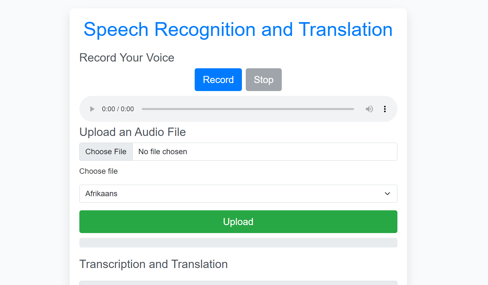

#  🎙️ VoiceVista: Transcribe, Translate, Transform

Unlock the power of spoken words with VoiceVista - your all-in-one solution for speech recognition and translation!
This web application allows users to transcribe audio files and translate the transcribed text into different languages. It supports both audio recording and file upload functionalities.

## 🌟 Features That Speak Volumes

- 🎤 **Record or Upload**: Capture audio on the fly or upload your files with ease
- 🌍 **Multilingual Magic**: Transcribe and translate into a world of languages
- 📄 **Format Flexibility**: Download your transcriptions in PDF, Word or TXT
- 🌓 **Dark Mode**: Easy on the eyes, day or night
- 🚀 **Lightning Fast**: Powered by cutting-edge speech recognition technology

## 💡 Why VoiceVista?

In a world where communication knows no borders, VoiceVista breaks down language barriers. Whether you're a student, professional, or language enthusiast, our app turns spoken words into written clarity in seconds.

## Screenshots

### Main Interface


### Transcription and Translation Section


## 🛠️Technologies Used

- Frontend: HTML, CSS, JavaScript
- Backend: Python, Flask
- Libraries: 
  - speech_recognition
  - pydub
  - googletrans
  - fpdf
  - python-docx

## 🚀 Setup and Installation

1. Clone the repository:
   ```
   git clone https://github.com/your-username/speech-recognition-translation-app.git
   cd speech-recognition-translation-app
   ```

2. Create a virtual environment and activate it:
   ```
   python -m venv venv
   source venv/bin/activate  # On Windows, use `venv\Scripts\activate`
   ```

3. Install the required packages:
   ```
   pip install flask speech_recognition pydub googletrans==3.1.0a0 fpdf python-docx
   ```

4. Run the application:
   ```
   python app.py
   ```

5. Open a web browser and navigate to `http://localhost:5000`

## Usage

1. Choose between recording audio or uploading an audio file.
2. Select the source language (for uploaded files) and target language for translation.
3. Process the audio to get the transcription and translation.
4. Optionally, change the target language to get a new translation.
5. Download the transcription and translation in your preferred format (PDF, Word, or TXT).

## Project Structure

- `app.py`: The main Flask application file containing server-side logic.
- `templates/index.html`: The HTML template for the web interface.
- `uploads/`: Temporary directory for uploaded audio files.
- `outputs/`: Directory for generated transcription files.

## 👥 Join the Conversation

We believe in the power of community. Contribute, suggest, or just say hello - every voice matters in making VoiceVista better!

---

🌟 Star us on GitHub | 🐛 Report an issue | 🤝 Contribute

Transform the way you interact with spoken language - try VoiceVista now!